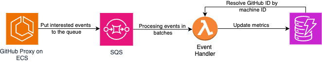

# Copilot Event Handler

This component processes events emitted from the GitHub Copilot Proxy via AWS SQS and stores them in a DynamoDB table.

## Solution Overview

A Lambda function is triggered when events are added to the SQS queue. Each event includes the machine ID of the user and the Copilot event.

The Lambda function first queries the DynamoDB table to find the corresponding GitHub ID using the machine ID. This mapping is established via the [Registration API](https://github.com/sidathasiri/copilot-registration-api) and the [Copilot Usage Analyzer tool](https://github.com/sidathasiri/copilot-usage-analyzer). Once the GitHub ID is identified, the function increments the counter for the specific Copilot event, reflecting the user's Copilot usage.

The entire infrastructure can be provisioned using the provided Terraform implementation.

**Note:** Ensure that you deploy the [Registration API](https://github.com/sidathasiri/copilot-registration-api) first to create the necessary DynamoDB table. Additionally, deploy the [Copilot Proxy Server](https://github.com/sidathasiri/copilot-proxy-server) to create the SQS queue and emit events.

## Setup Instructions

1. Run `npm install` to install the required dependencies.
2. Run `npm run package` to zip and prepare the Lambda function's source code.
3. Run `terraform init` to initialize the Terraform project.
4. Run `terraform apply` to deploy the infrastructure.
